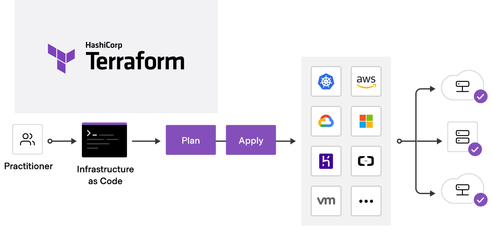

# DevOps Pipeline

## CI/CD Evreni

```

CI/CD:           (Jenkins, Git,  GitHub, GitOps,  GitHub Actions,    GitLab, GitLab CI,    Bitbucket, Bamboo)
Scripting        (Python, Bash, PowerShell)
Containers:      (Docker)
Orchestration:   (Kubernetes, Helm, ArgoCD)
Cloud            (AWS, Azure, GCP)
Virtualization:  (VMware, VirtualBox)
IaC:             (Terraform, Ansible, CloudFormation)
Monitoring:      (Prometheus, Grafana, ELK)
```
<hr>



AWS CLI kurulacak.

https://docs.aws.amazon.com/cli/latest/userguide/getting-started-install.html

```
aws --version
```


#### MacOS

==== 1. Makine : Amazon Linux oluşturduk. ===

MobaXterm üzerinden SSH ile terminalden bağlantı kuracağız.
Varsayılan kullanıcı adımız Username: ec2-user

Terraform'u kuracağız.

https://developer.hashicorp.com/terraform/install#linux

```
sudo yum install -y yum-utils shadow-utils
sudo yum-config-manager --add-repo https://rpm.releases.hashicorp.com/AmazonLinux/hashicorp.repo
sudo yum install terraform 
```

Kurulumu terminal üzerinden Terraform CLI'yın sürümünü kontrol ediyoruz. 
terraform version

Bulunduğun dizini görmek istedim.
```
pwd
```

Çalışma alanı için yeni klasör oluşturacağım. 
```
mkdir my-workspace-terraform

cd my-workspace-terraform
```

Bu klasörün içine yeni bir klasör açabilirim. 
```
mkdir ders1

ls
```

Sonradan onu silebilirim.
```
rm -rf ders1
```


Terraform üzerinden kullanıcı oluşturacağız.
https://registry.terraform.io/providers/hashicorp/aws/latest/docs/resources/iam_user

Terminalden text editörlerden ya nano'yu ya da vim'i kullanacaksın.
```
nano my-user.tf
```

```
vi my-user.tf
```

Bu dosyanın içine bir şey yazabilmek için i tuşuna bas.
Aşağıdaki kodu yapıştır.

```
resource "aws_iam_user" "my_resource1" {
  name = "Furkan"
  path = "/"

  tags = {
    tag-key = "Yazilim"
	environment = "Dev"
  }
}
```

İşin bitince ESC tuşuna bas.

Kaydetmek için de 

:wq

Enter'a bas.


======================

Çalıştığım klasör konumunda sadece bir defaya mahsus hazırlık komutunu çalıştırmak zorundayız.
terraform init


Ayarlarımızı görmek istedik. İlle de çalıştırmak zorunda değiliz.
terraform validate

```
terraform plan

terraform  apply
```


Bulut sağlayıcı ve bölgesi için ayar
https://registry.terraform.io/providers/hashicorp/aws/latest/docs

Çalışma dosyası oluşturdum.
```
vi my-provider.tf
```

```
terraform {
  required_providers {
    aws = {
      source  = "hashicorp/aws"
      version = "~> 6.0"
    }
  }
}

provider "aws" {
  region = "us-east-1"
}
```

Planı göster.
```
terraform plan
```

Planı uygula.
```
terraform apply
```

=========================

Kullancılar için bir group oluşturacağız.
https://registry.terraform.io/providers/hashicorp/aws/latest/docs/resources/iam_group

Dosya oluştur.
```
vi group.tf 
```


Kodu yapıştır.
```
resource "aws_iam_group" "arge" {
	name = "arge"
}
```


Dosyaların içlerini ve formatını düzeltir.
```
terraform fmt
```

Planı göster.
```
terraform plan
```

Planı uygula. -auto-approve :  Yes yazmadan otomatik onay verir.
```
terraform apply -auto-approve
```


=========================


Grup içine kullanıcı ekleme
https://registry.terraform.io/providers/hashicorp/aws/latest/docs/resources/iam_group_membership

Calisma dosyası aç. 
```
vi my-group-membership.tf
```


Bu kodu dosyaya yapıştır.
```
resource "aws_iam_group_membership" "team" {
  name = "tf-testing-group-membership"

  users = [
    aws_iam_user.user_one.name,
    aws_iam_user.user_two.name,
  ]

  group = aws_iam_group.group.name
}

resource "aws_iam_group" "group" {
  name = "Merkez"
}

resource "aws_iam_user" "user_one" {
  name = "Kaan"
}

resource "aws_iam_user" "user_two" {
  name = "Celalettin"
}
```


S3 servisini kullnacağız.
```
vi my-bucket.tf
```

```
resource "aws_s3_bucket" "example" {
  bucket = "my-tf-test-bucket"

  tags = {
    Name        = "My bucket"
    Environment = "Dev"
  }
}
```


Terraform ile oluştulan ve takip edilen o makinedeki bütün kaynakları yok eder.
```
terraform destroy
```

======================================

AWS CLI kurulu olacak.
https://docs.aws.amazon.com/cli/latest/userguide/getting-started-install.html


Local'e Windows için Terraform'u kurduk.
https://developer.hashicorp.com/terraform/install#windows


Path'i ayarladık.

Vscode içine pluginler kurduk.
https://marketplace.visualstudio.com/items?itemName=dannysteenman.aws-terraform-extension-pack


Çalışma alanı oluşturduk.
```
D:\workspace\devops-2025\devops-04-terraform
```


Local makinenin terminalinden AWS Cloud ortamına bağlanmak
```
aws configure 
```
